# SAGE-CLI — Design Principals

**Smart Agent Goal Execution CLI** — an interactive terminal REPL that accepts natural-language goals, delegates planning to an LLM, and iteratively executes shell commands with safety checks, user review, and full session telemetry.

---

## 1. High-Level Architecture

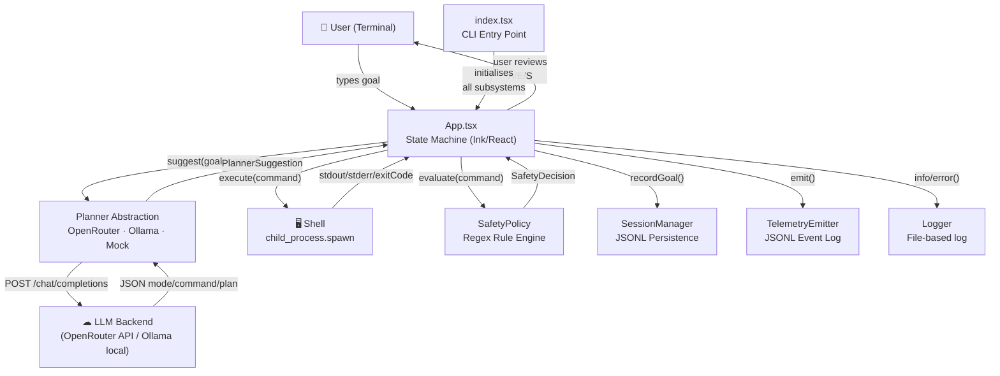

---

## 2. Layer Map

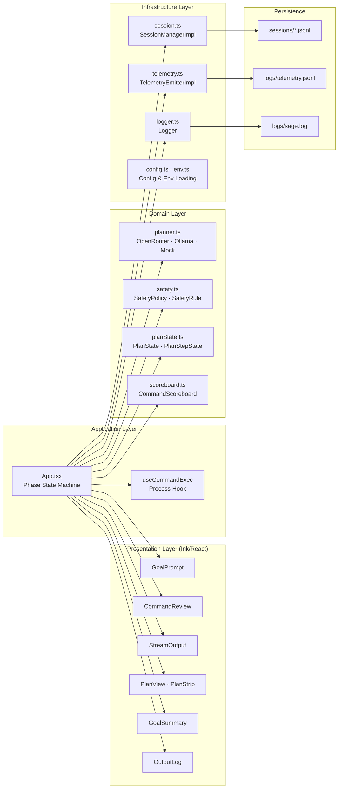

---

## 3. App Phase State Machine

The core of `App.tsx` is a strict linear state machine. Every user interaction and planner response drives a transition between exactly one active phase.

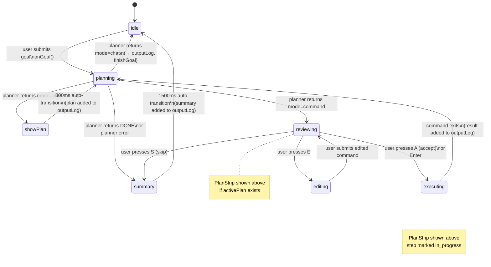

---

## 4. Planning Loop — Sequence Diagram

One full iteration from user goal to command result:

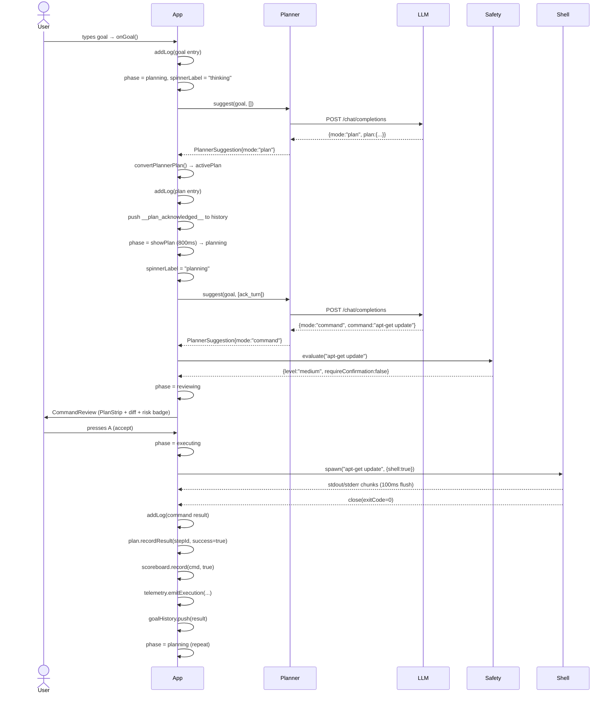

---

## 5. Planner Class Hierarchy

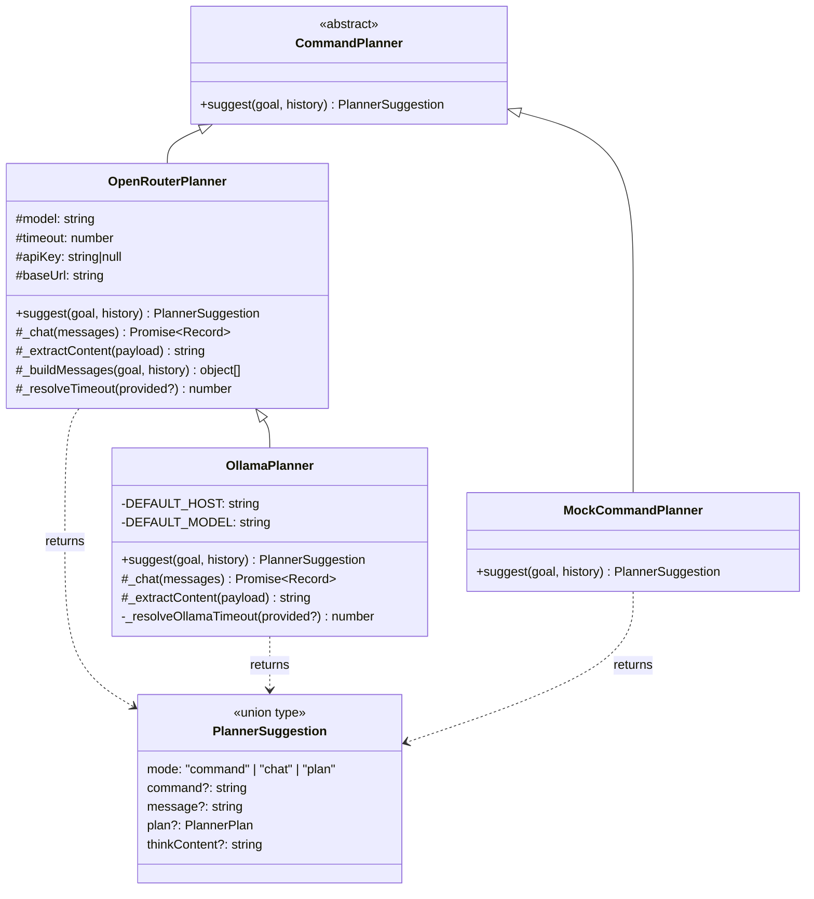

---

## 6. Plan State Model

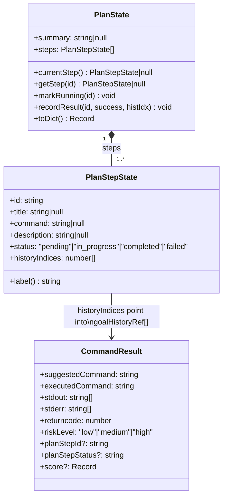

---

## 7. Safety Policy Engine

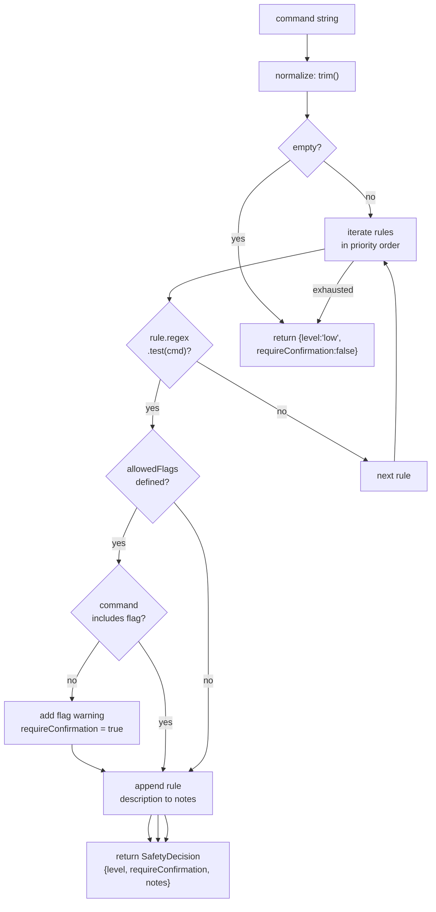

**Rule precedence (built-in defaults, highest to lowest):**

```mermaid
graph LR
    R1["rm -rf /\n HIGH · confirm"] --> R2
    R2["fork bomb :(){…\n HIGH · confirm"] --> R3
    R3["dd if=\n HIGH · confirm"] --> R4
    R4["mkfs · wipefs · mkpart\n HIGH · confirm"] --> R5
    R5["poweroff/shutdown/reboot\n HIGH · confirm"] --> R6
    R6["userdel\n HIGH · confirm"] --> R7
    R7["sudo\n MEDIUM"] --> R8
    R8["apt-get remove\n MEDIUM"] --> R9
    R9["chown -R · chmod 777\n MEDIUM"] --> R10
    R10["systemctl stop/restart\n MEDIUM"] --> R11
    R11["kill -9\n MEDIUM"] --> R12
    R12["apt-get install\n MEDIUM · needs -y"]
```

---

## 8. Output Log Data Flow

The `OutputLog` component provides the persistent scrollback history. Entries are appended to `outputLog[]` state as events occur and never removed.

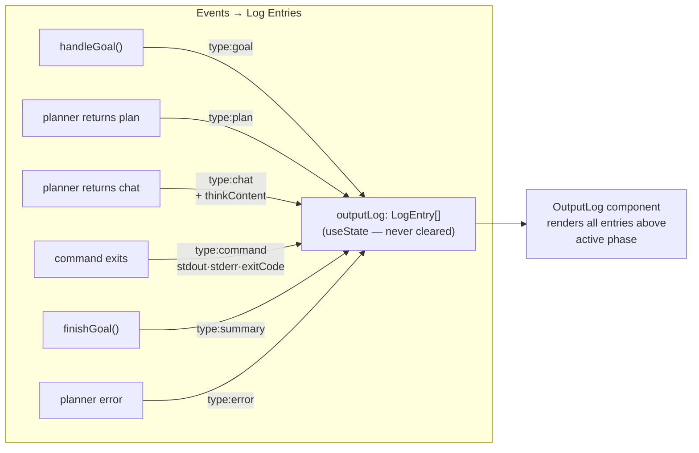

---

## 9. React Component Tree

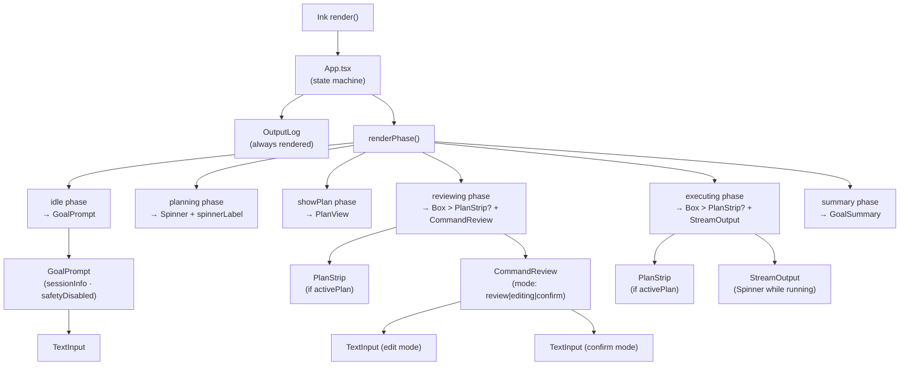

---

## 10. Infrastructure & Persistence

```mermaid
flowchart TD
    subgraph "index.tsx — startup sequence"
        S1["1. loadEnvironment()\nparse .env file"] --> S2
        S2["2. parseArgs(argv)\nCLI flags"] --> S3
        S3["3. ensureNotRoot()\ngeteuid check"] --> S4
        S4["4. AppConfig.load()\nconfig.json merge"] --> S5
        S5["5. resolve final settings\nflags › config › env › defaults"] --> S6
        S6["6. Logger.initialize()"] --> S7
        S7["7. TelemetryEmitterImpl.initialize()"] --> S8
        S8["8. SessionManagerImpl.initialize()"] --> S9
        S9["9. SafetyPolicy.load()\npolicy.json or defaults"] --> S10
        S10["10. createPlanner()\nOpenRouter|Ollama|Mock"] --> S11
        S11["11. render(<App />)"]
    end

    subgraph "Configuration Priority"
        C1["CLI flags\n(highest)"] --> C2["config.json\n--config path"] --> C3["environment\nvariables"] --> C4["built-in\ndefaults"]
    end

    subgraph "File Outputs"
        F1["sessions/\nYYYYMMDD-HHMMSS.jsonl\none file per session"]
        F2["logs/telemetry.jsonl\nappend-only event stream"]
        F3["logs/sage.log\ninfo/warning/error lines"]
    end
```

---

## 11. Planner History Construction

Before each `planner.suggest()` call, `buildPlannerHistory()` transforms `CommandResult[]` into a `PlannerTurn[]` that forms the conversation context sent to the LLM.

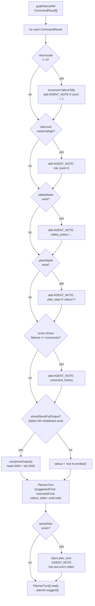

---

## 12. Key Design Decisions

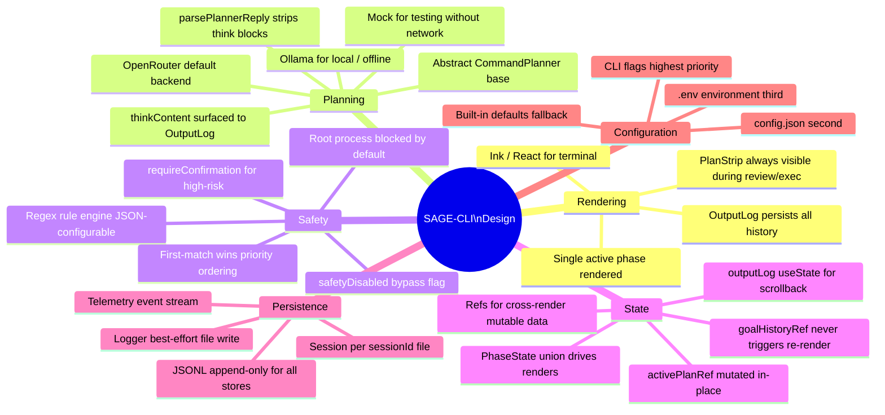
