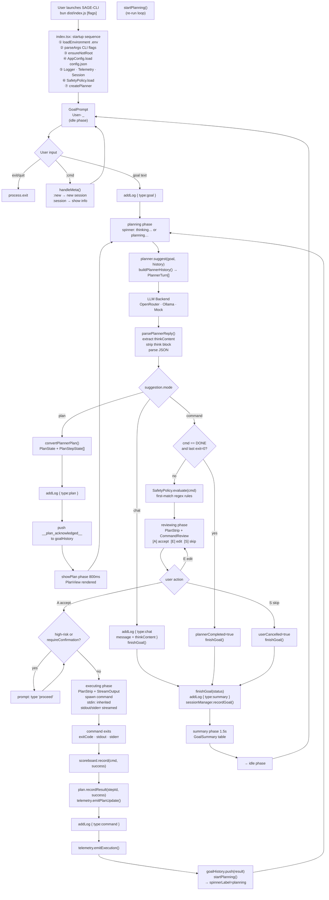

# Conversation Flow

SAGE-CLI turns natural-language goals into safe, supervised shell actions. The diagram below captures the full decision path a goal travels through the startup, planning, review, execution, and wrap-up phases.

---

## Key Behaviours

**Tri-modal planner output**
The planner returns one of three modes on every call. `chat` responses are logged immediately and end the current goal loop. `plan` responses create a `PlanState` that tracks step progress. `command` responses drive the review/execute cycle.

**Persistent OutputLog**
All notable events (goal text, plan received, chat message, command result, goal summary) are appended to `outputLog[]` state. This list is rendered above the active phase on every render, giving users a complete scrollback history without leaving the REPL.

**spinnerLabel**
The loading spinner label adapts to context: `thinking…` on the first planning call (no commands executed yet); `planning…` on subsequent calls (at least one command in history).

**Adaptive planner feedback**
`buildPlannerHistory()` enriches the conversation context sent to the LLM with `AGENT_NOTE:` annotations — failure tallies, risk levels, safety policy notes, plan step statuses, and command scoreboard scores — so the model has full situational awareness without the raw stdout consuming its context window.

**Safety gate**
`SafetyPolicy` evaluates each planner-suggested command against a priority-ordered list of regex rules before the review panel is shown. High-risk or policy-flagged commands require typing `proceed` to execute. Users can always edit (`E`) or skip (`S`) regardless of risk level.

**Plan step tracking**
When a plan is active, each command execution is associated with the current plan step. The step transitions: `pending` → `in_progress` (before `spawn`) → `completed`|`failed` (after exit). The `PlanStrip` component reflects these transitions in real-time during both `reviewing` and `executing` phases.

**Session & telemetry**
Every command execution emits a `telemetry.jsonl` event. When a goal completes (any status), the full goal record is appended to the session's `.jsonl` file. Both are best-effort append-only writes.

---

Use this flow as the reference when proposing architectural changes — the agent's contract with the planner, the safety gate, and the user review step should remain intact.
